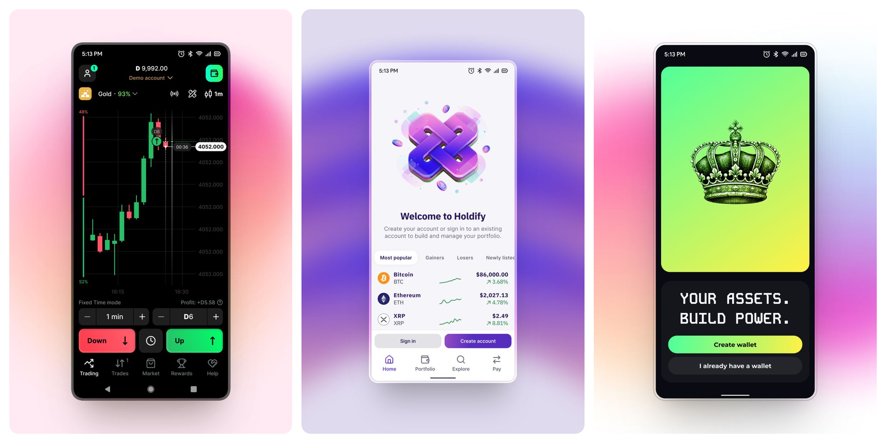

# Hi, I'm Dineth

Interested in iGaming & Trading systems.

## Projects (Live)

- **[waverider-pwa](https://www.tradewaverider.app)** - Gamified trading engine for Deriv with a minimal UI.
- **[dr-engine](https://dr-engine.vercel.app/)** - AI research framework generator using Perplexity AI.
- **[Ketapola](https://ketapola.online)** - Traditional Sri Lankan Awrudu Dice Game in iGaming context.
- **[Lumin](https://www.lumin.guru/)** - First AI-first astrotech company.

## Projects (Trading)

- **[kairos-trade](https://github.com/dinethlive/kairos-trade)** - Tick based adaptive auto trading CLI for Deriv synthetic indices.
- **[vix scanner](https://github.com/dinethlive/vix-scanner)** - Real-time volatility monitoring for Deriv Accumulator Options.
- **[PolyFlow](https://github.com/dinethlive/polyflow)** - Real-time analytics for Polymarket Solana 15-min markets.
- **[Solana MT5 Bridge](https://github.com/dinethlive/solana-mt5-bridge)** - Visualizes Oracle settlement data in MT5 for resolution markets.
- **Synapse** - Desktop bridge for MT5 trading signals to Deriv.com.

## Projects (iGaming)

- **[Crash Predict AI](https://github.com/dinethlive/crash-game-RAG)** - RAG-Powered Crash Game Prediction Engine
- **[Aviator Autobet Agent](https://github.com/dinethlive/aviator-autobet-agent)** - Aviator Betting Automation with Martingale + Risk Management
- **[Crash Point Signal Pro v3](https://github.com/dinethlive/crash-point-scanner)** - Pattern-Based Signal Intelligence for Crash Point (Game 601).

## Projects (Astrology)

- **30days.health** - Vedic astrology forecasting engine integrated with LLMs.
- **Jhora-api** - High-precision REST API for Vedic Astrology calculations.

## Projects (MT5)

- **[dbasket-EA](https://github.com/dinethlive/dbasket-EA)** - MT5 Expert Advisor for three-pair correlation hedging.
- **[dlab_orbit_EA](https://github.com/dinethlive/dlab_orbit_EA)** - VWAP Breakout EA with Smart Recovery algorithms.
- **[Triangular Arbitrage EA](https://github.com/dinethlive/Triangular-Arbitrage-EA-for-BTC-ETH-USD)** - Triangular arbitrage bot for crypto pairs on Deriv MT5.
- **polymarket-to-mt5** - Connects Polymarket Oracle data to MT5 charts.

## Legacy Projects (Before LLMs)

- **[MT5-Indicators Collection](https://github.com/dinethlive/MT5-indicators-collection)** - Collection of MT5 indicators for Deriv trading.
- **[Crash Game Scanner](https://github.com/dinethlive/crash-game-scanner)** - Real-time monitor and predictor for 1xBet crash game.
- **[Fishing Game Patterns Recognizer](https://github.com/dinethlive/fishing-game-patterns-recognizer)** - Python tool for pattern recognition in fishing games.
- **[Crash Game Predictor](https://github.com/dinethlive/crash-game-predictor)** - GUI prediction tool for betting games using ML.
- **NFT Marketplace** - Fully functional NFT marketplace in 2022(DCrypto).

## Early-Career Designs (Figma)

- **[Pinterest Portfolio](https://www.pinterest.com/dinethlive/)**

## Connect

---
